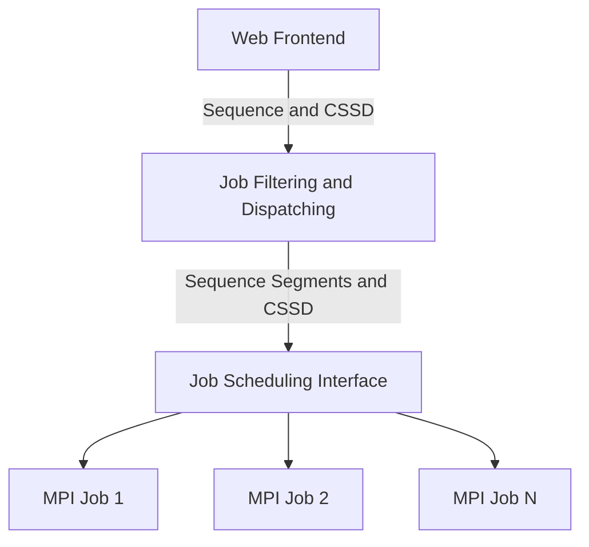
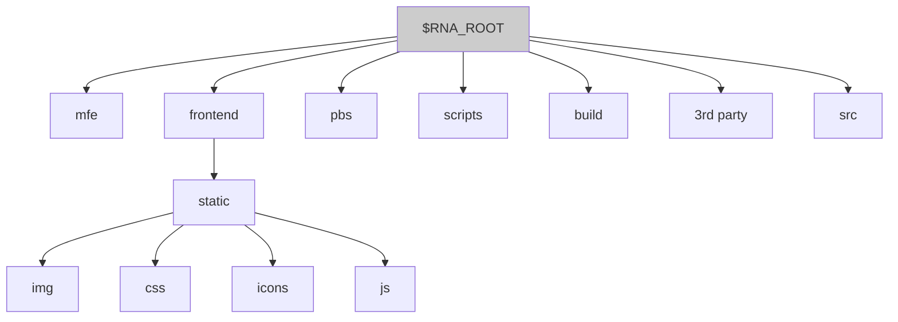

# STRUCTURAL RNA HOMOLOGY SEARCH
A topology-based RNA genomic search tool, designed with intent to be applied to functional non-coding RNAs in Flavivirus genomes.

This document is meant as an introduction to the technical requirements for building and deploying the tool which currently lives at https://rna.liacs.nl

For further information refer to *Zammit A., Helwerda L., Olsthoorn R.C.L., Verbeek F., and Gultyaev A.P., A database of flavivirus RNA structures with a search algorithm for pseudoknots and triple base-base interactions*

## Contents
1. [Overview](#overview)
2. [Installation Prerequisites](#installation-prerequisites)
3. [Building the Tool](#building-the-tool)
4. [Basic Usage](#basic-usage)

## Overview
Structural RNA Homology Search (SRHS) is a multithreaded C application for searching viral RNA genomes based on the definition of Consensus Secondary Structure Descriptors, in turn based on structural descriptors specified in WUSS (Washington University Secondary Structure) notation. The tool supports parallel computation based on MPI and off-the-shelf job scheduling, and is mainly intented to be used via a simple frontend web user interface.

Once built and deployed, the anticipated user workflow is straightforward and is abstractly depicted as follows:

Given that all prerequisites listed below are met, the default build target will install all components required to enable the above workflow.
## Installation Prerequisites
Although designed with a cross-platform approach in mind, the tool was designed, developed and tested primarily on linux distributions. The primary development, testing, and deployment platforms used were Ubuntu 16.04 LTS, with the current live platform running Ubuntu 19.04. Following is the recommended configuration and build procedure for the tool, assuming a clean install of Ubuntu 16.04+.

## Environment Setup, and Source build including Dependencies

1. **Basic prerequisites**
Using *apt* or an alternative package manager, the following tools are required to be installed. Where relevant, tool versions used for development/testing/deployment are provided in the second column in the table below. If the version number is important for correct operation, this is stated in the rightmost column:

|tool|tested/deployed version|recommended version|
|:-:|:-:|:-:|
|sshd|7.9||
|make|4.2.1||
|gcc<sup>1</sup>|8.3.0|8.3.0+|
|clang<sup>1</sup>|8.0.0|8.0.0+|
|git|2.20.1||
|cmake|3.13.4|3.13.4|
|libssl-dev|1.1|1.1|
|libmicrohttpd-dev|0.9.62|0.9.62|
|libjansson-dev|2.12|2.12+|
|libgnutls-dev|2.8|2.8+|
|libcurl4-gnutls-dev|||
|libulfius-dev<sup>2</sup>|2.5.2|2.5.2|
|valgrind<sup>3</sup>|3.14.0|3.14+|
|jemalloc<sup>4</sup>|5.2.0|5.2.0+|
|mongodb|3.6.8|3.6.8+|

<sup>1</sup>SRHS may be built using either gcc or clang. If google sanitizers are used for development/debugging, however, the appropriate clang preferences should be set in the SRHS provided Makefile.

<sup>2</sup>If a build from source for the *ulfius* web framework is preferred, then the following is the recommended way (assumes the build target is for a Release version):
```
git clone https://github.com/babelouest/ulfius.git [ 2.6.5 ]
mkdir build
cd build
cmake .. -DWITH_JANSSON=on -DWITH_CURL=on -DWITH_GNUTLS=on -DWITH_WEBSOCKET=on -DWITH_YDER=off -DBUILD_UWSC=on -DBUILD_STATIC=off -DBUILD_ULFIUS_TESTING=off -DBUILD_ULFIUS_DOCUMENTATION=off -DINSTALL_HEADER=on -DBUILD_RPM=off -DCMAKE_BUILD_TYPE=Release
make
sudo make install
```

<sup>3</sup>optional. applies only for testing/debugging

<sup>4</sup>SRHS makes use of a replacement memory allocator to the standard malloc. A build from source is recommended, as follows:
```
git clone https://github.com/jemalloc/jemalloc.git
./autogen.sh
CC=clang CFLAGS="-Ofast -funsafe-math-optimizations -freciprocal-math -ftree-vectorize -fshort-enums" ./configure --disable-cxx --disable-debug --disable-stats --enable-experimental-smallocx --enable-lazy-lock --disable-fill --enable-cache-oblivious --disable-log --disable-opt-safety-checks --disable-syscall
make
sudo make install
export LD_LIBRARY_PATH=$LD_LIBRARY_PATH:/usr/local/lib  # ensure this change persists user sessions
```

2. **Configuring MongoDB**
SRHS needs a MongoDB db **scoRNA** that is properly configured and accessible by the same user that runs the tool's *frontend*, *dispatcher* and *job scheduler interface* (by default, assumed to be the unix username **rna**). **scoRNA** holds the following 6 collections:

***users***:
```
_id : Object ID
name : String
sub_id : String 				# auth id for this user
ref_id : 64-bit Integer
```

***counters***:
```
_id : String 					# user ref_id
seq : 32-bit Integer 				# incremental sequence counter for this user
```

***sequences***:
```
_id : Object ID
accession : String
definition : String
3'UTR : String
group : String
ref_id : 64-bit Integer
```

***cs***:
```
_id : Object ID
cs : String					# NEWLINE separate CSSD string (1st line CSSD, 2nd line POSVARS)
name : String
ref_id : 64-bit Integer
published : Boolean				# this CSSD available for all users?
```

***jobs***:
```
_id : Object ID
sequence_id : Object ID
cssd_id : Object ID
status : 32-bit Integer				# job status init, pending, submitted, done
error : 32-bit Integer				# ok, fail
num_windows : 32-bit Integer			# total number of regions of interest for this job's sequence
num_windows_success : 32-bit Integer
num_windows_fail : 32-bit Integer
ref_id : 64-bit Integer				# user reference id
```

***results***:
```
_id : Object ID
job_id : Object OD
time : Double  					# averaged out CPU time in seconds for this hit
position : 32-bit Integer
fe : Double 					# stacking FE estimate
hit_string : String
ref_id : 64-bit Integer
```

Indices are required for **scoRNA**, either for performance reasons or to ensure data integrity. The following is the  recommended configuration.

**Indices required for performance reasons**.
```
db.sequences.createIndex( { group: 1 }, { unique: false } )
db.sequences.createIndex( { ref_id: 1 }, { unique: false } )
db.cs.createIndex( { ref_id: 1 }, { unique: false } )
db.jobs.createIndex( { sequence_id: 1 }, { unique: false } )
db.jobs.createIndex( { cssd_id: 1 }, { unique: false } )
db.jobs.createIndex( { status: 1 }, { unique: false } )
db.jobs.createIndex( { num_windows: 1 }, { unique: false } )
db.jobs.createIndex( { num_windows_success: 1 }, { unique: false } )
db.jobs.createIndex( { num_windows_fail: 1 }, { unique: false } )
db.jobs.createIndex( { ref_id: 1 }, { unique: false } )
db.results.createIndex( { job_id: 1 }, { unique: false } )
db.results.createIndex( { job_id: 1, position: 1 }, { unique: false } )
db.results.createIndex( { time: 1 }, { unique: false } )
db.results.createIndex( { position: 1 }, { unique: false } )
db.results.createIndex( { fe: 1 }, { unique: false } )
db.results.createIndex( { hit_string: 1 }, { unique: false } )
db.results.createIndex( { ref_id: 1 }, { unique: false } )
```

**Indices required for data integrity**.
```
db.cs.createIndex( { cs: 1, ref_id: 1 }, { unique: true } )
db.cs.createIndex( { name: 1, ref_id: 1 }, { unique: true } )
db.results.createIndex( { job_id: 1, position: 1, hit_string: 1 }, { unique: true } )
db.sequences.createIndex( { accession: 1, ref_id: 1 }, { unique: true } )
db.sequences.createIndex( { definition: 1, ref_id: 1 }, { unique: true } )
```

**We also need a "text index" for 3'UTR, in order to exceed the default 1024 index key limit**.
```
db.sequences.createIndex( { "3'UTR": "text", ref_id: 1 }, { unique: true } )   
```

Note that indices may be dropped and then rebuilt as described above, using the following mongo shell command:
```
db.runCommand( { dropIndexes: "sequences", index: "3'UTR_1" } )   # drop sequences text index
```

When migrating service from an old to a new install, *mongodump* and *mongorestore* can be used to transfer whole db copies of the current database. Moreover, if MongoDB is to be started with a replica set, then, assuming that MongoDB is started up as a *systemd* service, the following exec startup command replaces the default one in */lib/systemd/system/mongodb.service*, also assuming the **mongo** is installed to the default */var/lib* location and binds to 127.0.0.1:

```
ExecStart=/usr/bin/mongod --replSet "rs0" --bind_ip "127.0.0.1" --dbpath /var/lib/mongodb
```
 
Note that a replica (*rs0*, in the above case) set is required to enable watch-based realtime streaming of database updates, as required by the *distribution* and *frontend* components. It is assumed that **mongo** is started as a non-priviliged user. In the current installation, this user is **mongodb**. If at any point, MongoDB is started as root, then ownership of */var/lib/mongodb* might need to be reset as follows:

```
chown -R mongodb:mongodb * in /var/lib/mongodb where mongodb
```

As per MongoDB documentation, a clean install requires the replica set to be initiated from the **mongo** shell as follows:

```
rs.initiate ()
```

SRHS also needs C bindings to access MongoDB. It is recommended to build libmongoc [ 1.16.0 ] and any of its dependencies from source:
```
wget https://github.com/mongodb/mongo-c-driver/releases/download/1.16.0/mongo-c-driver-1.16.0.tar.gz
tar xvf mongo-c-driver-1.16.0.tar.gz
cd mongo-c-driver-1.16.0
mkdir cmake-build
cd cmake-build
cmake .. -DENABLE_AUTOMATIC_INIT_AND_CLEANUP=OFF -DCMAKE_BUILD_TYPE=Release
make 
sudo make install
```

3. **Installing MPI**
SRHS needs a MPI-2 compatible implementation to operate. In principle, any compliant implementation suffices. Open MPI version 4 has been used throughout development and testing. The recommend installation procedure is as follows:
```
wget https://download.open-mpi.org/release/open-mpi/v4.0/openmpi-4.0.1.tar.gz  [ 4.0.1 ]
tar xvf openmpi-4.0.1.tar.gz
cd openmpi-4.0.1
./configure --enable-dependency-tracking --enable-silent-rules --enable-branch-probabilities --disable-mpi-fortran --disable-openib-dynamic-sl --disable-openib-udcm --disable-openib-rdmacm --enable-memchecker --enable-install-libpmix --disable-io-romio --disable-fast-install --with-mpi-param-check --without-ofi --without-xpmem --without-knem --without-cma --without-libltdl --without-x --without-cray-pmi --with-alps=no --without-udreg --without-lsf --without-sge --without-moab --without-singularity --without-fca --without-hcoll --without-pvfs2 --without-lustre --without-psm --without-psm2 --without-mxm --with-orte --with-gnu-ld --enable-binaries
make
sudo make install
```

4. **Installing a Cluster Workload Manager**
The scheduling interface component of SRHS needs access to a cluster workload manager to manage MPI jobs and regulate the MPI execution environment. By default, this is assumed to be Torque/PBS. The following is the recommended installation procedure for the head node and any worker nodes:

For a Xenial Ubuntu distribution (16.04) or earler, then Torque/PBS should be available through the distribution's package management suite. For later versions, a build from source is necessary. The first requirement is to install v5.4 of gcc, which is known to correctly build PBS:

```
wget https://ftp.gnu.org/gnu/gcc/gcc-5.4.0/gcc-5.4.0.tar.gz
tar xvf gcc-5.4.0.tar.gz
cd gcc-5.4.0
./contrib/download_prerequisites
mkdir ../gcc-build  # as per gcc documentation, build directory must be outside of source tree
cd ../gcc-build
../gcc-5.4.0/configure --enable-languages=c,c++ --disable-multilib
make 
sudo make install
# switch to/from gcc-5.4 using update-alternatives)
```

Install the following prerequisites for Torque/PBS:
* libtool
* libxml2-dev
* zlib1g-dev
* libboost1.65-dev

Then get and build Torque/PBS:
```
git clone https://github.com/adaptivecomputing/torque.git
cd torque
./autogen.sh
./configure
make
sudo make install
# depending on the specific environment it might be necessary to run ldconfig to update library paths
```

To configure Torque/PBS at the head node, assuming the default install destination is */var/spool/torque*:
* update /var/spool/torque/server_name to include head node hostname
* update /var/spool/torque/server_priv/nodes to include head node hostname, if head node is to act as worker node as well
* at the distribution's root directory run:
```
./torque.setup root
qterm
```
 
* copy and adapt the systemd service template files from the *contrib/systemd* subdirectory of the distribution, to */usr/lib/systemd/system/*, one for each of **trqauthd**, **pbs_server**, **pbs_mom**, **pbs_sched**, and **ompi_server**. Once adapted, enable each service for launch at bootup using:
```
systemctl enable *.service
```

The first four Torque/PBS service components listed above do not need special consideration, but **ompi_server** does. SRHS uses **ompi_server** as the data server to exchange contact information between Open MPI jobs and the *dispatcher*. If SRHS is installed so as to be run by user **rna** under */home/rna/RNA* (see installation note further below), then the correct configuration for the **ompi_server** systemd service file is as follows:
```
[Unit]
Description=MPI ompi-server
Requires=network.target local-fs.target
Wants=rsyslog.target
After=trqauthd.service network.target local-fs.target rsyslog.target

[Service]
Type=simple
User=rna

GuessMainPID=yes

ExecStart=/usr/local/bin/ompi-server --no-daemonize -r /home/rna/RNA/ompi-server.uri

# Define kill parameters for shutdown.
#
# The server should be shutdown with a SIGTERM rather than using qterm
# (which will shutdown the active server in an HA configuration).
KillMode=control-group
KillSignal=SIGTERM
TimeoutStopSec=30

[Install]
WantedBy=multi-user.target
```

The above service script assumes that **ompi_server** has been installed to */usr/local/bin*, and as is different from the other **trqauthd** and **pbs_*** components is run under user **rna**.

As a final step for head node configuration, the Torque/PBS queue manager needs to be configured. Many of the configuration parameters may be left as default, or customized as per requirement. The following is the output of the *qmgr* command on the current live server:
```
qmgr -c 'p s':
#
# Create queues and set their attributes.
#
#
# Create and define queue batch
#
create queue batch
set queue batch queue_type = Execution
set queue batch resources_default.walltime = 01:00:00
set queue batch resources_default.nodes = 1
set queue batch enabled = True
set queue batch started = True
#
# Set server attributes.
#
set server scheduling = True
set server acl_hosts = localhost
set server acl_hosts += rna
set server managers = root@localhost
set server operators = root@localhost
set server default_queue = batch
set server log_events = 2047
set server mail_from = adm
set server node_check_rate = 150
set server tcp_timeout = 300
set server job_stat_rate = 300
set server poll_jobs = True
set server down_on_error = True
set server mom_job_sync = True
set server keep_completed = 0
set server submit_hosts = rna
set server next_job_number = 47
set server moab_array_compatible = True
set server nppcu = 1
set server timeout_for_job_delete = 120
set server timeout_for_job_requeue = 120
set server note_append_on_error = True
```

Getting Torque/PBS to operate on a worker node, is not very dissimilar to operation on the head node. Binaries are installed either via a package manager, or via the build from source procedure described above, or by invoking
```
make packages
```

at the head node, which creates self-extracting, distributable packages for use at worker nodes. Moreover, each worker node must accomodate the following configuration changes:
* */var/spool/torque/mom_priv/config* must point to the head node (see *$pbsserver* field)
* */var/spool/torque/server_name* must point to the head node
* */usr/lib/systemd/system/pbs_mom.service* must be properly configured, similar to that of the head node. Depending on where libtorque has been installed, it might be necessary to add

```
Environment=LD_LIBRARY_PATH=$LD_LIBRARY_PATH:<libtorque library dir>
```

in *pbs_mom.service*. Each worker node's name (not FQDN) must be included in the head node's */var/spool/torque/server_priv/nodes* file. It is recommended that outbound network communication to the head node is updated accordingly on the worker node's firewall. In case of, say **ufw**:
```
ufw allow out from any to <head node IP>
```

Finally, each worker node must invoke the SRHS script *get_ompi_server_uri* script on boot up, or when **ompi_server** changes are made on the head node. On the current live server, this is done via the *.bashrc* script.

---

***!Note that ompi_server operations work correctly when and only when worker nodes are booted up AFTER the head node. It is recommended that after a full restart of head node and worker nodes, ompi_server operation is verfied and that all MPI worker nodes that should be spawned by SRHS are operating normally. For further details see below!***

---

5. **Typical Firewall Configuration**
Securing head (and any worker) nodes is beyond the scope of this document. However, at a minimum, open communication should be allowed between head node and any worker nodes, and HTTPS (port 443) access to the head node should be allowed from anywhere. There is no requirement for worker nodes to be accessible by any node other than the head node.

6. **Other Configuration**
Security certificates are required for proper operation of the frontend component (via *ulfius* web framework).

The following manglers/compressors are used:
```
sudo npm install terser -g
terser --compress --mangle -- rna.js > rna-1.0.min.js; gzip --best rna-1.0.min.js

sudo apt install cleancss
cleancss -o rna-1.0.min.css rna.css; gzip --best rna-1.0.min.css

sudo npm install html-minifier -g
html-minifier --collapse-whitespace --remove-comments --remove-optional-tags --remove-redundant-attributes --remove-script-type-attributes --remove-tag-whitespace --use-short-doctype index.html.orig -o index.html; gzip --best index.html

sudo apt install astyle
astyle --style=java --indent-switches --indent-cases --indent-preproc-block --indent-preproc-cond --indent-col1-comments --indent=tab=20 --break-blocks --pad-oper --pad-first-paren-out --unpad-paren --pad-header --delete-empty-lines --align-pointer=name --break-closing-braces --break-elseifs --break-one-line-headers --add-braces --attach-return-type --max-code-length=80 --max-continuation-indent=40 --break-after-logical --min-conditional-indent=0 --align-reference=name *.c
```

Note that SRHS is configured to allow zipped content.

## Building the Tool

Once all prerequisites have been installed and verified, version 1.0 of SRHS may be currently obtained, as a source repository, from https://github.com/LeidenRNA/SRHS.git

After the remote repository is cloned to the local directory (hereafter *\$RNA_ROOT*), the following directory structure should be accessible to, and assumed to be located within the home directory of *\$RNA_USER*. Here it is  assumed that *\$RNA_USER* is **rna** and *\$RNA_ROOT* is equivalent to */home/\$RNA_USER/RNA*:


1. *\$RNA_ROOT/mfe*
Legacy, stacking free energy (FE) statistics. Currently still required by the build process but not serving current live functionality

2. *\$RNA_ROOT/frontend/static*
Static files served by the *frontend* component:
* HTML files (*\$RNA_ROOT/frontend/static*)
	* *index.html*, *about.html*, and *stats.svg*
	Note that whereas *index.html* is served directly by the *ulfius framework* via the *frontend* component, *about.html* and *stats.svg* are dynamically loaded by JavaScript (see *rna.js*). Moreover, to the extent possible, static content is served minified and/or compressed (*.min.gz*). When compressors/manglers are involved, the original files are also available in the respective directory - for example, *index.html* is actually served as *index.html.gz* with the original unminified version stored as *index.html.orig*. Small static files, such as *about.html* and *stats.svg*, are served as is. All HTML code resides in *index.html.orig* with the exception of:
		* *about.html*: about HTML content, loaded dynamically. Kept aside to facilitate quick updates to Terms & Conditions, etc
		* *stats.svg*: template SVG element, used to serve and dynamically change (using *jQuery*) *Jobs/Hits statistics*. See **About SHRS** section in the tool itself for a description of *Jobs/Hits statistics*. Kept aside to avoid clutter in the main *index.html* file
	

* Images and Icons (*\$RNA_ROOT/frontend/static/img* and *\$RNA_ROOT/frontend/static/icons*)
	* static imagery served off *\$RNA_ROOT/frontend/static/img*, with the exception of *favicon.ico* which is stored under *\$RNA_ROOT/frontend/static*. *\$RNA_ROOT/frontend/static/icons* are redundant copies of [feather icons](https://feathericons.com/) icon data. For performance reasons, icon data is stored directly inside *index.html* and *about.html*


* CSS files (*\$RNA_ROOT/frontend/static/css*)
	* CSS directory for 3rd party (**bootstrap** and **dashboard**) style sheets, and the main SHRS style sheet (*rna.css*). Minified and compressed whenever feasible


* JavaScript scripts (*\$RNA_ROOT/frontend/static/js*)
	* JavaScript directory for 3rd party libraries, and the main script (*rna.js*). Minified and compressed whenever feasible. The main script depends on the following 3rd party libraries:

|library|tested/deployed version|recommended version|
|:-:|:-:|:-:|
|bootstrap|4.3.1|4.3.1+|
|knockout|3.5.0|3.5.0+|
|feather|4.21.0||
|jquery| 3.4.0| 3.4.0+|
|js.cookie|2.2.0|2.2.0+| 
|mousetrap|1.4.6|1.4.6+| 
|mousetrap-bind-dictionary|||   
|moment|2.24.0||
|lock|11.20.3| 11.20.3+|
|FileSaver| 2.0.2||

The above libraries are stored and served off *\$RNA_ROOT/frontend/static/js*. The original, unminified and uncompressed version of *rna-1.0.min.js.gz* is stored as *rna.js*.

3. *\$RNA_ROOT/pbs*
Repository of a single *Torque/PBS* script, **qsub.script**. This script is a template required by the *dispatcher* component to launch MPI worker jobs (using *Torque/PBS*). Should not typically require changes, unless the **ompi_server** URI file (currently, *ompi-server.uri*) is changed.

***!NOTE: Currently, the path to ompi-server.uri is hard-coded in qsub.script. This script is invoked by dispatch (distribute.c) using system () which typically executes the command using /bin/bash, which in turn does not have access to $RNA_ROOT readily available. Changes made to $RNA_ROOT therefore need to be reflected in this script!***

4. *\$RNA_ROOT/scripts*
Main respository of shell scripts required by **SHRS** to launch and operate the tool.

***Launcher scripts***:

* **scheduler**: Starts a job scheduler interface. Script depends on value of *\$RNA_ROOT*, launches the service on *\$RNA_SI_PORT* and expectes to communicate with other components at *\$RNA_HEADNODE*

* **dispatch**: Starts a SHRS job dispatcher. Script depends on value of *\$RNA_ROOT*, launching distribution services on port *\$RNA_DBE_PORT*, while depending on *\$RNA_DS_SERVER* and *\$RNA_DS_PORT* for datastore (MongoDB) communication, and *\$RNA_SI_SERVER* and *\$RNA_SI_PORT* for interfacing to the job scheduler. this script also depends on the correct operation of ompi-server and URI information expected at *\$RNA_ROOT/ompi-server.uri*

* **frontend**: Serves an SHRS *frontend* instance. Script depends on value of *\$RNA_ROOT*, launching the service on port *\$RNA_FRONTEND_PORT*, and expects to find an operational dispatcher at *\$RNA_DBE_SERVER*:*\$RNA_DBE_PORT*, and a MongoDB datastore at *\$RNA_DS_SERVER*:*\$RNA_DS_PORT*

* **rna-sys**: Convenience launcher script to start/stop SHRS instance (*--start*, *--stop*, *--restart*)

* **ompi**: Launches the *Open MPI* data sharing service on the head node. Intended to be used with systemd service scripts. Depends on *\$RNA_ROOT*, and stores the *Open MPI* contact information for the server at *\$RNA_ROOT/ompi-server.uri*. As a work around, the script replaces the reported URI (by default, 127.0.0.1) with the proper hostname of the head node. This is so that worker nodes retrieving a copy of *ompi-server.uri* using **get_ompi_server_uri** are able to reach the server

* **get_ompi_server_uri**: Script used by worker nodes to retrieve a copy of the *Open MPI* data sharing service URI from the head node. Depends on *\$RNA_ROOT*, *\$RNA_HEADNODE* and the name and location of *ompi-server.uri*.
***NOTE***: ***This script, launched as a systemd service unit depends on the head node being up and running in time for worker nodes to find the required information***.

***Convenience scripts***:

* **killrna**: Kill all SHRS PBS jobs. Used by **rna-sys** after component shutdown. ***NOTE***: ***currently hard-coded for Jobname "RNA"***

* **k**: Given a) process name and b) signal; sends signal to all processes running with name. After a number of unsuccessful tries to gracefully shut down service, force kills (-*SIGHUP*) any remaining processes with that given name

* **b**: Launches given executable using *nohup* and redirects *stdout* and *stderr* to a (non-rotated) log file. Location of log file is under *\$RNA_ROOT*

* **mongodb.backend**: Manually launch MongoDB instances in replica mode. Not intended to be used for launching MongoDB in a production environment

***Build-related scripts***:
* **gen_tests.py**: Python script that accepts paired CSSDs and Sequences from an input file (by default, *tests.in*, under *\$RNA_ROOT*) and generates an output file (by default, *tests.out*, under *\$RNA_ROOT*) that is incorporated into the build process when generating test cases

5. *\$RNA_ROOT/build*
Build directory for SRHS

6. *\$RNA_ROOT/3rd party*
Repository of license information for all 3rd party tools and libraries

7. *\$RNA_ROOT/src*
Source directory for building SRHS. Compilation units can be grouped by related functionality as follows:
```
src
└───stacking free energy estimation
│   │   mfe.[ch]
|   |   mfe_params.h
│   
└───model building and analysis
|   │   m_build.[ch]
|   │   m_analyse.[ch]
|   │   m_seq_bp.[ch]
|   │   m_search.[ch]
|   │   m_optimize.[ch]
|   │   m_list.[ch]
|   │   m_model.h
|
└───job scheduling interfacing
|   │   c_jobsched_server.[ch]
|   │   c_jobsched_client.[ch]
|   │   c_jobsched.[ch]
|
└───job dispatching
|   │   distribute.[ch]
|   │   allocate.[ch]
|
└───frontend servicing
|   │   frontend.[ch]
|   │   interface.[ch]
|   │   filter.[ch]
|
└───datastore interfacing
|   │   datastore.[ch]
|
└───testing
|   │   tests.[ch]
|
└───utility and 3rd party
|   │   crc32.[ch]
|   │   binn.[ch]
|   │   util.[ch]
|   │   simclist.[ch]
|   │   sequence.[ch]
|
└───rna.[ch]
```

**Running and Testing the Build**
To build SRHS, run make from *\$RNA_ROOT*. If the build is successful, the main binary executable **rna** should be found under *\$RNA_ROOT*.

Although **rna** is not primarily intended to be used as a command-line tool, a number of command-line arguments can be used for basic operations and testing. For a quick test that **rna** has been successfully built, run:
```
./rna --test
```

In this command mode, **rna** runs a batch of simple sequence/CSSD tests that were previously generated using the **gen_tests.py** script and taking *tests.in* as input. If successful, the expected program output ends should end as follows:
>2020FEB04.224430 I BATCH_TESTS  63 of 63 tests passed (100%) in 000.01 seconds

For other basic command-line usage of **rna** see further below.

The tool is intended to be automatically launched after head node and work node(s) boot up. However, for maintenance purposes, the tool can be shutdown and restarted using the **rna-sys** script:
```
rna-sys --stop
```

and
```
rna-sys --start
```

or

```
rna-sys --restart
```

By default, SRHS dumps logs to three log files under *\$RNA_ROOT*, with the filename pattern **component.dd-mon-HH:mm:ss.log**, where component is one of *frontend*, *dispatch*, and *scheduler*. This means that new log files are started after SRHS is stopped and restarted.

For basic tool troubleshooting, it is recommended to browse log files for warnings or errors. Moreover, the following general checkpoints should be observed to address operational issues:

* By default, the *frontend* component is launched on port 443 (SSL). Though not recommended, it can also be alternatively be configured to run on port 80 (*\$RNA_FRONTEND_PORT*). In either case, as part of the *make* build process *setcap* is invoked to allow **rna** to launch against port numbers < 1024. Therefore, it should be ensured that the make process has completed successfully, including using administrator privilages when prompted by **setcap**.

* All the relevant environment variables need to be correctly exported. On the head node, assuming that both *frontend* and *dispatch* components are running on the same machine, the current live setup is as follows:
	* RNA_HEADNODE=localhost
	* RNA_ROOT=/home/rna/RNA
	* RNA_SI_SERVER=127.0.0.1
	* RNA_SI_PORT=8888
	* RNA_DBE_SERVER=127.0.0.1
	* RNA_DBE_PORT=8889
	* RNA_FRONTEND_PORT=443
	* RNA_USER=rna
	* RNA_DS_SERVER=127.0.0.1
	* RNA_DS_PORT=27017
	* PATH=$PATH:/home/rna/RNA/scripts


* **rna** makes use of a 3rd party memory allocator *jemalloc*. Proper access to and configuration of this tool should be checked:
	* LD_LIBRARY_PATH=/usr/local/lib	  # ensure libjemalloc is accessible
	* export MALLOC_CONF="background_thread:true,metadata_thp:auto,dirty_decay_ms:3000000,muzzy_decay_ms:3000000" # and properly configured

On worker nodes, a minimal config should set the following variables (the following is for the current live worker node):
* RNA_ROOT=/home/rna/RNA
* RNA_USER=rna
* RNA_HEADNODE=rna					# current domain name of head node is "rna"
* RNA_SI_SERVER=rna       
* RNA_SI_PORT=8888
* RNA_DS_SERVER=rna
* RNA_DS_PORT=27017
* RNA_DBE_SERVER=rna 
* RNA_DBE_PORT=8889

Moreover, for each worker node it must be ensure that the following script is invoked at least once after system boot up:
* **get_ompi_server_uri**

	* When accepting SSL browser sessions, **rna** must have access to key data. It is therefore imperative the *\$RNA_USER*, as a non-privilaged user, has appropriate access to (*letsencrypt*) data directories and files. See the *Other Configuration* section above for details on setting up file access control lists as part of key deployment.

	* **rna** must also have access properly configured Torque/PBS nodes and resources. After bootup, or after starting **rna-sys**, at least one MPI job should be seen in the default PBS queue. Running *qstat -a* from the command-line should produce output similar to the following (depending on how many default RNA tasks are launched):
```
qstat -a

localhost:
Job ID | Username | Queue | Jobname | SessID | NDS | TSK | Memory | Time | S | Time

----
7519.localhost | rna | batch | RNA | 1999 | 1 | 1 | -- | 23:59:59 | R | 00:45:00
7520.localhost | rna | batch | RNA | 1999 | 1 | 1 | -- | 23:59:59 | R | 00:45:03
7521.localhost | rna | batch | RNA | 1999 | 1 | 1 | -- | 23:59:59 | R | 00:45:07
7522.localhost | rna | batch | RNA | 1999 | 1 | 1 | -- | 23:59:59 | R | 00:45:11
7523.localhost | rna | batch | RNA | 1999 | 1 | 1 | -- | 23:59:59 | R | 00:45:15
7524.localhost | rna | batch | RNA | 1999 | 1 | 1 | -- | 23:59:59 | R | 00:45:19
7525.localhost | rna | batch | RNA | 1999 | 1 | 1 | -- | 23:59:59 | R | 00:45:22
7526.localhost | rna | batch | RNA | 1999 | 1 | 1 | -- | 23:59:59 | R | 00:45:26
```

Correct node configuration should be inspected (at the head node):
```
pbsnodes -a
localhost
     state = job-exclusive
     power_state = Running
```
...
```
rna-node-001
     state = free
     power_state = Running
```
...


Moreover, it is essential that *ompi-server.uri* under *\$RNA_ROOT* should be in sync (that is, identical content) between the head node and any worker nodes.

## Basic Usage
SRHS is intended to be launched using the scripts provided in *\$RNA_ROOT/scripts* (mainly using **rna-sys**, or **scheduler**, **dispatch**, and **frontend** for launching components individually).

However, the binary executable file **rna** can also be invoked at the command line prompt for testing, troubleshooting, and debugging purposes, and for manipulating the relevant MongoDB collections.

The general syntax is as follows:

**rna** --ds-server=<*server name or IP address*> --ds-port=<*server port*> --collection=*collection* *operation* <*arguments for collection/operation*>

For example, when reading a given sequence with accession number *NC_001474.2* from the *sequences* collection, the following command is invoked:
```
./rna --ds-server=127.0.0.1 --ds-port=27017 --collection=sequences --read --accession="NC_001474.2"
```

***Sequence Operations and Arguments*** ( --collection=sequences )
+ --create --group="*group*" --definition="*definition*"  --accession="*accession*" --seq-nt="*nucleotide string*" --ref-id=<*user id*>
+ --read --id="*object-id*"
+ --read --accession="*accession*"
+ --delete --id="*object-id*" --ref-id=<*user id*>
+ --delete --accession="*accession*" --ref-id=<*user id*>

***CSSD Operations and Arguments*** ( --collection=cs )
+ --create --ss="*structure descriptor*" --pos-var="*positional variables*" --cs-name="*name*" --published=[ 0 | 1 ] --ref-id=<*user id*>
+ --read --cs-name="*name*"
+ --read --id="*object-id*"
+ --delete --id="*object-id*" --ref-id=<*user id*>
+ --delete --cs-name="*name*" --ref-id=<*user id*>

***Jobs Operations and Arguments*** ( --collection=jobs )
+ --create --seq-id="*object-id*" --cssd-id="*object-id*" --job-status=[ 0 | 1 | 2  | 3 ]\* --job-error=[ 0 | -1 ]\*\* --ref-id=<*user id*>
+ --read --id="*object-id*"
+ --update --id="*object-id*" --ref-id=<*user id*> --job-status=[ 0 | 1 | 2  | 3 ]\* --job-error=[ 0 | -1 ]\*\*
+ --delete --id="*object-id*" --ref-id=<*user id*>

\*0=job initialized, 1=waiting for resources, 2=submitted, 3=done

\*\*0=job status ok,-1=job status fail

***Results (Hits)*** ( --collection=results )
+ --create --job-id="*object-id*" --result-hit=<*hit_string*>\* --ref-id=<*user id*>
+ --read --job-id="*object-id*"
+ --delete --job-id="*object-id*" --ref-id=<*user id*>

\* string concatenation of *CPU time* (double), *1-indexed position* (int32), *stacking free energy estimate* (double), *hit_string* (string representation of specific structure that matched sequence at given position); seperated by TABS (see <em>S_HIT_SEPARATOR</em>)

***Users*** ( --collection=users )
+ --create --user-name="*user name or email address*" --sub-id="*encrypted auth0 token id*" --ref-id=<*user id*>
+ --read --sub-id="*encrypted auth0 token id*"
+ --delete --ref-id=<*user id*>

***Standalone Testing***
+ ./rna --test
